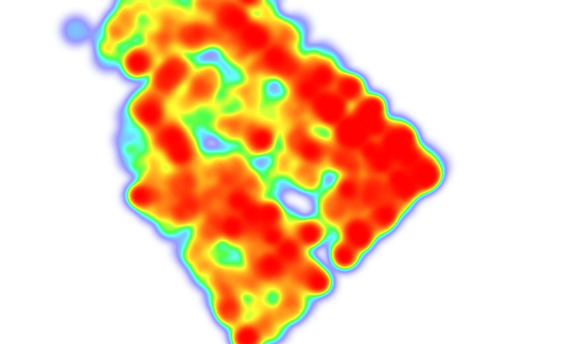
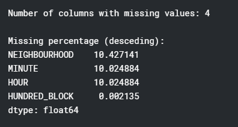

# Exploratory Analysis of Vancouver Crimes
Analysis of Vancouver crimes recorded from 2013 to 2019.
#### More Details: go to the [Kaggle Kernel ](https://www.kaggle.com/agilesifaka/exploratory-analysis-of-vancouver-crime-data)

### Dataset description:
The dataset is collected from the City of Vancouver Open Data Catalogue. The dataset has over 600K rows with 10 columns of location,recorded crime time data, and crime type data.

### Missing values:

From the above missing data summary, we can we have 4 columns with missing data: they are NEIGHHOURHOOD (10.42% missing), MINUTE(10.02% missing), HOUR(10.02% missing), and HUNDRED_BLOCK(0.002% missing).

I cleaned the dataset and handled the missing values of NEIGHHOURHOOD column later with street-neighbourhood key-value pair based  
on existing data. It worked pretty well and I removed outliers because they are recorded from neighbour city.

### Quick breakdown with some visualizations
### Crime by time:
1. Year

2. Month

3. Day

4. Hour

### Crime by location:
1. Street Block

2. Neighbour

3. Latitude and Longtitude: 
