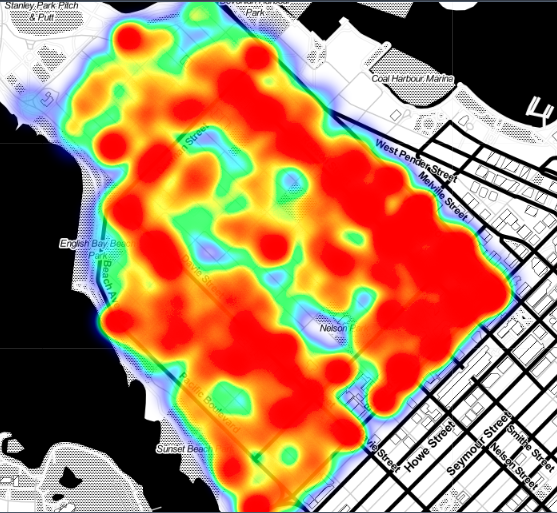
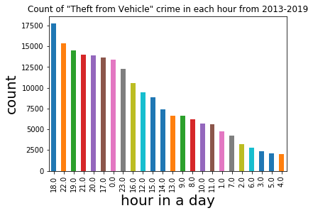
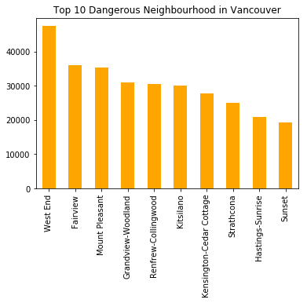

# Exploratory Analysis of Vancouver Crimes
Analysis of Vancouver crimes recorded from 2013 to 2019.
#### More Details: go to the [Kaggle Kernel ](https://www.kaggle.com/agilesifaka/exploratory-analysis-of-vancouver-crime-data)

### Dataset description:
The dataset is collected from the City of Vancouver Open Data Catalogue. The dataset has over 600K rows with 10 columns of location,recorded crime time data, and crime type data.

### Missing values:

From the above missing data summary, we can we have 4 columns with missing data: they are NEIGHHOURHOOD (10.42% missing), MINUTE(10.02% missing), HOUR(10.02% missing), and HUNDRED_BLOCK(0.002% missing).

I cleaned the dataset and handled the missing values of NEIGHHOURHOOD column later with street-neighbourhood key-value pair based  
on existing data. It worked pretty well and I removed outliers because they are recorded from neighbour city.

### Quick breakdown with some visualizations:
### Crime by type:

It appears that the most common type of is associated with vehicle in Vancouver: Theft from Vehicle, Theft of Vehicle, Theft of Bicycle and Vehicle Collision. Since 2003, there are 203431 crime categorized as "Theft from Vehicle"; people do need to add some sort of car alarm system in their car in Vancouver. I will explore the data focused on the "Theft from Vehicle" crime.

### "Theft from Vehicle" Crime by time:
1. Year: Has the "Theft from Vehicle" crime decreased over time?

From the above trendline, we can see the number of crime categorized as "Theft from Vehicle" indeed dropped twice from 2004 to 2011 and from 2018 to 2019. There is least number of "Theft from Vehicle" in 2011.

## When is the popular recorded month, day, and hour of "Theft from Vehicle" crime in a day?
2. Month: "Theft from Vehicle" crime counted by month:

The value doesn't fluctuate a lot. January has the highest number of "Theft from Vehicle" crime in Vancouver. It turns out each month has quite similar number of "Theft from Vehicle" crime happening in Vancouver from 2003 to 2019.

3. Day: "Theft from Vehicle" crime counted by day:

The bar chart shows similar observations comparing to the count by month except there exists a trend of decreasing number of recorded crime from the 1st day of a month to the end of a month.
This trend can be caused by sampling bias. There are witness-reported crime and police-spotted crime. Maybe, police officers just happened to be go out more often during the beginning of the month and spotted more crimes? We don't know the cause.
If they can record how crimes are discovered, it would be very helpful.

4. Hour: "Theft from Vehicle" crime counted by hour:

From the above chart, we can observe that it became unsafe to park your car in Vancouver in the afternoon or at night. The top 10 counted hour of "Theft from Vehicle" crime happened after 12 PM.

### Crime by location:
1. Street Block: What are the top 10 crime populated block based on crime data?

Granville street is the most crime-populated street based on the crime record.

2. Neighbour:

West End is the most dangerours neighbourhood in Vancouver. The crimes recorded in West End can draw a complete map of the neighbourhood using data from 2003 to 2019.

From a treemap, we can see the most common crime in West End is "Theft from vehicle". 

3. Latitude and Longtitude: 
